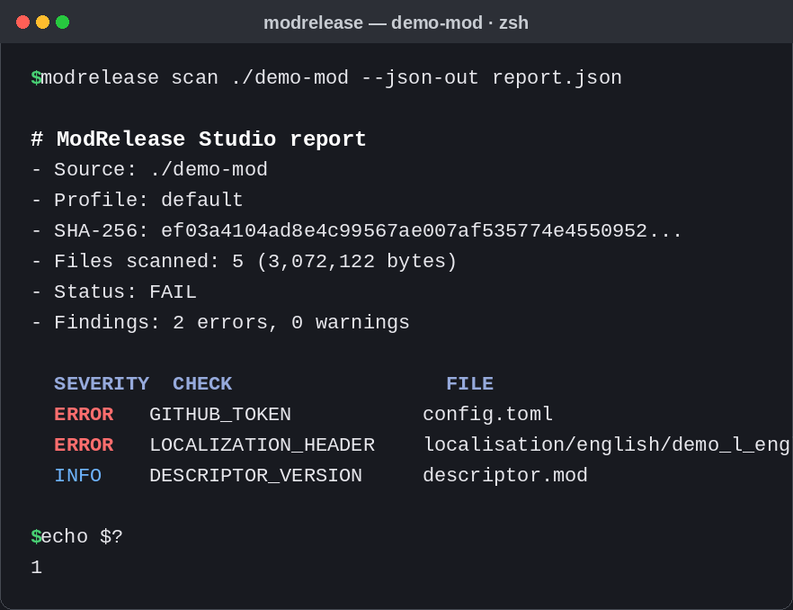

# ModRelease Studio

**Release preflight for game mods and mod packs.** Scan a folder or ZIP, catch common packaging and metadata problems, and publish a readable report before players download the build.

[](https://github.com/GhosTnever-lkm/modrelease-studio/actions/workflows/preflight.yml)
[](https://github.com/GhosTnever-lkm/modrelease-studio/releases)
[](https://github.com/GhosTnever-lkm/modrelease-studio/actions/workflows/preflight.yml)
[](LICENSE)

ModRelease Studio is local-first: your mod files stay on your machine unless you choose to upload the generated report. Reports include the source basename, not its full local path or parent directories. It uses only the Python standard library.

## Who is it for

- **Mod authors** shipping their first release and wanting to avoid "my mod is broken / doesn't install" reports.
- **Modpack and collection maintainers** who review many ZIPs and need one consistent preflight check.
- **Game teams and CI** that want a release gate before a build reaches players.

Current unreleased changes are tracked in [CHANGELOG.md](CHANGELOG.md).

## The problem it solves

Every mod release is judged in the first minutes after upload: does it install, does it look finished, and is anything broken or embarrassing in the files? Catching packaging mistakes, accidental secrets, and missing metadata by hand is slow and inconsistent. ModRelease Studio turns that into one repeatable command and a clean report.

## What it checks

- Folder and ZIP contents, unsafe and non-portable archive paths (including traversal, drive/colon syntax, Windows device names, and trailing dots/spaces), duplicate paths, and case/Unicode-normalization collisions that can behave differently across filesystems, and rejects ZIP entries that are not regular files.
- Accidental secrets in common text/config files (private keys, AWS access-key IDs, GitHub and Slack tokens, Discord webhooks, and likely hard-coded API keys).
- Paradox Clausewitz `descriptor.mod` metadata and localization YAML issues.
- Missing release notes, OS-specific junk, and unexpectedly large files.
- Stable SHA-256 fingerprint of the build, JSON/Markdown reports, and finding changes between two builds.



## Three real scenarios

**1. A mod author before the first release.** You built a Paradox mod, added the `descriptor.mod`, wrote some localization, and want to publish. Run one command before uploading:

```console
modrelease scan ./my-mod --md-out release-report.md
```

A clean report (`Status: READY`) means no blocking findings were detected—not that a release is certified safe. Review the report and files before publishing; secret detection is best-effort.

**2. A modpack maintainer screening many ZIPs.** You collect mods from many authors and cannot open every archive. Scan them all with the same command, read one report per ZIP, and only forward the ones that pass:

```console
modrelease scan ./modpack/part1.zip --json-out check.json
modrelease scan ./modpack/part2.zip --json-out check.json
```

The JSON report (with SHA-256 + findings) also makes an audit trail for your collection.

**3. A team adding a release gate to CI.** Add the [ModRelease Gate GitHub Action](https://github.com/GhosTnever-lkm/modrelease-studio-action) to your mod repository so every pull request runs the preflight and blocks merge on release-blocking findings. Mod authors get feedback in the PR, and no broken build reaches the workshop.

## Quick start

Requires Python 3.11 or newer. From a checkout:

```console
modrelease --version
python -m modrelease_studio scan ./my-mod --md-out release-report.md --json-out release-report.json
```

Or install it in an isolated environment:

```console
python -m pip install .
modrelease scan ./my-mod.zip --md-out release-report.md
```

The command exits with `0` when there are no critical/error findings, `1` when release-blocking findings exist, and `2` for an invalid input or configuration. Warnings are advisory by default.

## Verify a downloaded release

GitHub Releases publish both the ZIP archive and a `.sha256` sidecar. After downloading both files, verify that the archive was not corrupted in transit. The checksum is distributed alongside the archive; it is an integrity check, not a separate signature or provenance attestation.

**Linux (GNU coreutils):**

```bash
sha256sum --check ModRelease-Studio-v0.3.36.zip.sha256
```

**macOS:**

```bash
shasum -a 256 -c ModRelease-Studio-v0.3.36.zip.sha256
```

**Windows PowerShell:**

```powershell
$archive = ".\ModRelease-Studio-v0.3.36.zip"
$checksumFile = ".\ModRelease-Studio-v0.3.36.zip.sha256"
$expected = ((Get-Content $checksumFile -Raw) -split "\s+")[0].ToLowerInvariant()
$actual = (Get-FileHash $archive -Algorithm SHA256).Hash.ToLowerInvariant()
if ($actual -ne $expected) { throw "SHA-256 mismatch; do not use this archive." }
"SHA-256 OK"
```

For a different release, substitute its matching version in both filenames.

## Compare builds

```console
modrelease compare ./previous-build ./candidate-build
```

## Configure checks

Copy `modrelease.example.toml` to `modrelease.toml` in your mod root:

```toml
[scan]
required_files = ["README.md", "CHANGELOG.md", "LICENSE"]
max_file_bytes = 2000000
```

`required_files` checks basenames anywhere in the package. `max_file_bytes` accepts integers from 1 to 16 MiB; larger values are rejected so a project config cannot disable the scanner’s bounded-memory behavior. Secret scanning is a best-effort detector; review findings and do not treat a clean scan as proof that a release contains no secret.

## Scan limits and completeness

- **Entry count:** folder and ZIP scans index at most 30,000 entries. More entries produce the blocking `ENTRY_LIMIT` finding; entries beyond the limit are not included, so the report is incomplete. Reduce the package and scan again.
- **ZIP unpacked size:** archives whose aggregate uncompressed file size exceeds 4 GiB receive the blocking `ARCHIVE_SIZE_LIMIT` finding. Split the release archive and rerun the scan.
- **Text-file content:** the default `max_file_bytes` is 2,000,000 bytes per text file. Larger recognized text files are skipped by content checks and receive `LARGE_TEXT_FILE`; configure a value from 1 byte through 16 MiB when appropriate.
- **Paradox parsing:** `descriptor.mod` and localization text have a separate 2 MiB parsing ceiling.

Any blocking limit finding means the preflight is not a clean, complete release approval.

## GitHub Actions

Add a workflow to your mod repository:

```yaml
name: Mod release preflight
on:
  pull_request:
  push:
    branches: [main]
jobs:
  preflight:
    runs-on: ubuntu-latest
    steps:
      - uses: actions/checkout@v7
      - uses: actions/setup-python@v7
        with:
          python-version: "3.12"
      - name: Scan mod
        run: |
          python -m pip install "modrelease-studio @ git+https://github.com/GhosTnever-lkm/modrelease-studio.git@v0.3.25"
          modrelease scan . --md-out modrelease-report.md --json-out modrelease-report.json
      - name: Upload report
        if: always()
        uses: actions/upload-artifact@v7
        with:
          name: modrelease-report
          path: |
            modrelease-report.md
            modrelease-report.json
```

The included `.github/workflows/preflight.yml` installs this repository's local project with `python -m pip install .` and runs the tool against the included clean example mod. In a mod repository, use the pinned tagged source shown above; `pip install .` would try to install the mod repository itself. The example is pinned to `v0.3.25`.

## Project-specific release policy

Set `required_paths` in `modrelease.toml` to enforce exact paths or glob patterns (case-insensitive). Use `required_paths_severity = "ERROR"` to make missing policy paths fail the scan and CI; the default is `WARNING`. For example, `examples/policies/paradox-release.toml` requires a root `descriptor.mod` and README. See the [sample policy report](examples/policies/paradox-release-report.md). Existing `required_files` remains useful when only the filename matters, regardless of its directory. The checked-in policy is exercised against the example mod in CI.

```toml
[scan]
required_paths = ["descriptor.mod", "localisation/*.yml"]
required_paths_severity = "ERROR"
```

## Current scope

This is an early, intentionally conservative release checker. It does not fully parse every game scripting language, verify that a mod launches in-game, or replace platform-specific validators. Paradox support currently focuses on descriptor metadata and localization files. Add a rule or open an issue if you want another game's packaging checks.

## Development

```console
python -m modrelease_studio --help
python -m pip install -e ".[test]"
coverage run --source=modrelease_studio -m unittest discover -s tests -v
coverage report --include="modrelease_studio/*.py" --fail-under=80
```

The 52-test suite currently covers 90% of package lines. CI enforces at least 80% line coverage on Ubuntu with Python 3.11–3.13, plus Windows and macOS with Python 3.13.

See [CONTRIBUTING.md](CONTRIBUTING.md), [SECURITY.md](SECURITY.md), and [CHANGELOG.md](CHANGELOG.md).

## ☕ Support / Pro Version

ModRelease Studio is free and open source. There is no paid Pro edition yet. If the tool is useful, you can support its development on [Buy Me a Coffee](https://buymeacoffee.com/azizazimov8) or [GitHub Sponsors](https://github.com/sponsors/GhosTnever-lkm).

You can also send a supported asset to one of these public receive addresses:

| Network | Asset standard | Address |
|---|---|---|
| Bitcoin | BTC | `bc1qn75pj4n7gyl2k5kf2f97elvyenz52q6nn2g30u` |
| Tron | TRC-20 | `TCBSy38X57hA6w2onJcxom24x1febc1mP1` |
| BNB Smart Chain | BEP-20 | `0xD431a917961E0b086B96D9F72b5C8fF19b19068a` |

**Send funds only on the matching network.** Do not send a different network's asset to these addresses.

### Pricing

- **Core (this repo)** — free, MIT-licensed, run anywhere: `modrelease scan` / `compare`.
- **ModRelease Gate (GitHub Action)** — free to use in CI: [modrelease-studio-action](https://github.com/GhosTnever-lkm/modrelease-studio-action).
- **Pro** — planned: custom rule packs, team reporting, and release dashboards. Details will be announced in the repo and on the [landing page](https://ghostnever-lkm.github.io/modrelease-studio/).
- **Services** — custom checks, release-audit consulting, and setup as a release gate for your mod distribution. Contact us with your case.

### Contact

- GitHub: [GhosTnever-lkm](https://github.com/GhosTnever-lkm)
- Email: <azizazimov038l@gmail.com>

## License

MIT. See [LICENSE](LICENSE).
